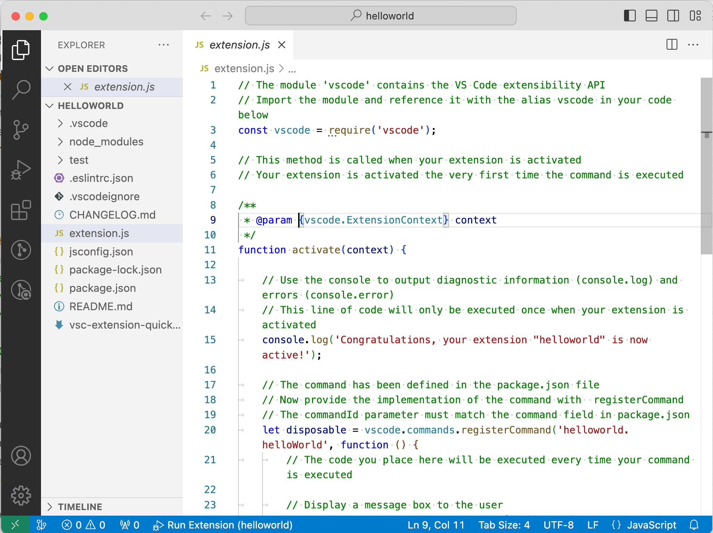

# 1.1 你好, 插件

本节配置开发环境，用工具创建一个最简单的插件程序。先确保本地安装了 VS Code 较新的版本。

在开始之前可以通过命令行查看下VS Code版本号（更多命令行参数通过`code --help`查看）：

```
$ code --version
1.82.2
abd2f3db4bdb28f9e95536dfa84d8479f1eb312d
arm64
```

使用`code --list-extensions`命令查看已经安装的插件列表：

```
$ code --list-extensions
dtsvet.vscode-wasm
golang.go
...
```

为了开发扩展还需要安装 Node.js、Git工具，然后通过以下命令安装 Yeoman 和 VS Code Extension 生成工具（用于初始化插件工程的脚手架工具、并非是构建插件的必须工具）：

```
npm install -g yo generator-code
```

安装成功后使用 `yo` 命令生成一个 JavaScript 的插件工程（打开了类型检查选项）：

```
$ yo code

     _-----_     ╭──────────────────────────╮
    |       |    │   Welcome to the Visual  │
    |--(o)--|    │   Studio Code Extension  │
   `---------´   │        generator!        │
    ( _´U`_ )    ╰──────────────────────────╯
    /___A___\   /
     |  ~  |     
   __'.___.'__   
 ´   `  |° ´ Y ` 

? What type of extension do you want to create? New Extension (JavaScript)
? What's the name of your extension? helloworld
? What's the identifier of your extension? helloworld
? What's the description of your extension? 
? Enable JavaScript type checking in 'jsconfig.json'? Yes
? Initialize a git repository? No
? Which package manager to use? npm
```

为了便于理解，我们选择了生成JavaScript的插件工程，同时打开了机遇JSDoc的类型检查功能。生成的工程用 VS Code 单独窗口打开，其中 `extension.js` 是插件的主代码文件：



点击 F5 进入调试运行，运行时会打开一个新的 VS Code 窗口作为新插件的执行环境。在插件环境的 VS Code 中打开命令行面板，输入 “helloworld” 执行插件命令，将弹出一个信息框显示“Hello World from helloworld!”。效果如下图：


插件可以正常运行了。
