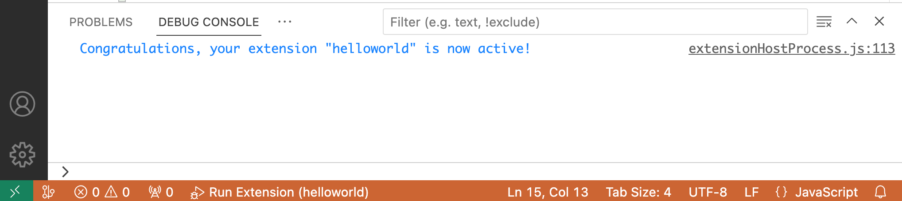
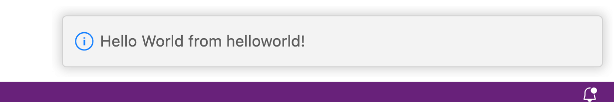

# 1.2 理解插件代码

我们现在看下 `extension.js` 文件代码：

```js
const vscode = require('vscode');

function activate(context /** @param {vscode.ExtensionContext} */ ) { ... }
function deactivate() {}

module.exports = {activate, deactivate}
```

插件模块有2个特殊的函数：activate 是在插件被第一次激活时被调用，deactivate 是插件被卸载或者禁用时调用。因此activate函数类似很多编程语言的main函数，是插件的入口函数。


activate入口函数有一个 `vscode.ExtensionContext` 类型的 context 参赛，表示VS Code 实例的上下文环境。然后通过 `console.log` 可以在 F5 调试执行时在调试信息窗口看到输出。

```js
function activate(context /** @param {vscode.ExtensionContext} */ ) {
  console.log('Congratulations, your extension "helloworld" is now active!');
  ...
}
```

控制台日志显示如下：



插件命令的注册过程如下：

```js
function activate(context) {
  ...
  let disposable = vscode.commands.registerCommand('helloworld.helloWorld', function () {
    vscode.window.showInformationMessage('Hello World from helloworld!');
  });
  context.subscriptions.push(disposable);
}
```

首先用 `vscode.commands.registerCommand` 生成一个插件命令，命令对应是一个闭包函数。然后通过 `context.subscriptions.push(disposable)` 注册到 VS Code 实例上下文中。

插件的命令是“helloworld.helloWorld”，在 `package.json` 文件的 `contributes.commands` 配置必须对应。

```json
{
  ...
  "main": "./extension.js",
  "contributes": {
    "commands": [{
      "command": "helloworld.helloWorld",
      "title": "Hello World"
    }]
  },
  ...
}
```

当插件命令被执行时，在闭包函数通过 `vscode.window.showInformationMessage('...')` 函数调用显示一个弹窗信息。如图所示：



插件的工作顺序大致为：调用 `activate` 函数激活插件，`vscode.commands.registerCommand` 将函数包装为命令，`context.subscriptions.push` 注册命令，用户执行插件命令时调用被命令包装的函数。

