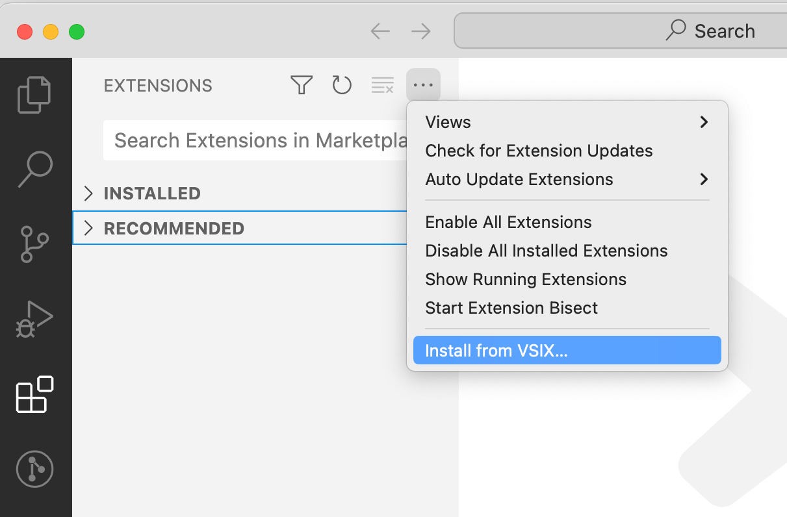
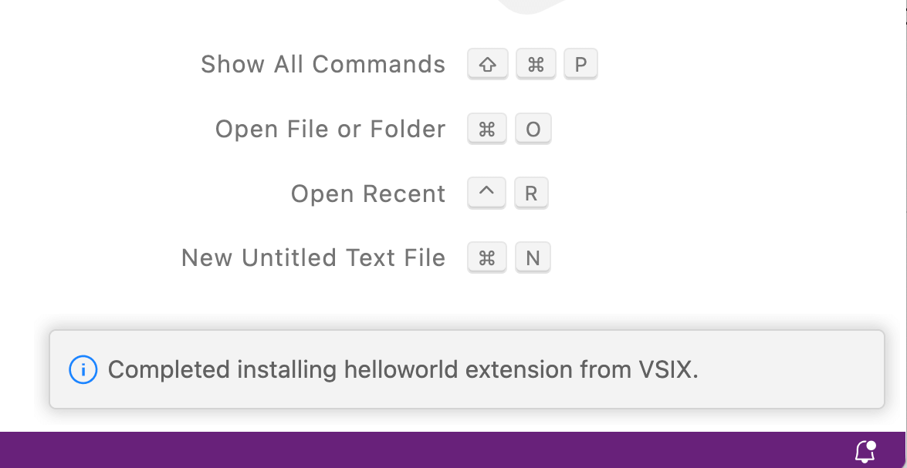

# 1.3 打包插件

本地开发并测试插件正常工作后，还需要打包分发给其他用户使用。要打包插件需要先安装 `vsce` 命令（Visual Studio Code Extensions首字母缩写）：

```
npm install -g @vscode/vsce
```

然后切换到插件目录对应的命令行环境，输入`vsce package`命令进行打包：

```
$ vsce package
ERROR  It seems the README.md still contains template text. Make sure to edit the README.md file before you package or publish your extension.
```

第一次执行可能会提示`README.md`文件是模板内容需要更新。更新README文件后重新执行打包命令：

```
$ vsce package
 WARNING  A 'repository' field is missing from the 'package.json' manifest file.
Do you want to continue? [y/N] y
 WARNING  LICENSE, LICENSE.md, or LICENSE.txt not found
Do you want to continue? [y/N] y
 DONE  Packaged: /Users/chai/vscode-extdev-book/examples/helloworld/helloworld-0.0.1.vsix (6 files, 2.6KB)
```

打包过程中还会检查仓库、版权文件等内容是否合规，这是是一个正规的插件发布到插件市场必须要提供的信息。为了简化流程这里先忽略这些警告信息，最终生成了 `helloworld-0.0.1.vsix` 打包后到插件。

`vsix` 是标准的 zip 压缩格式，其中打包的文件对应如下目录：

```
├── [Content_Types].xml
├── extension
│   ├── CHANGELOG.md
│   ├── README.md
│   ├── extension.js
│   └── package.json
└── extension.vsixmanifest
```

然后打开一个新的VS Code程序，在插件视图点击“Views and More Actions...”按钮，选择“Install from VSIX...”菜单：



安装成功后会弹出提示安装成功：



这样在本地可以使用开发的插件了。

