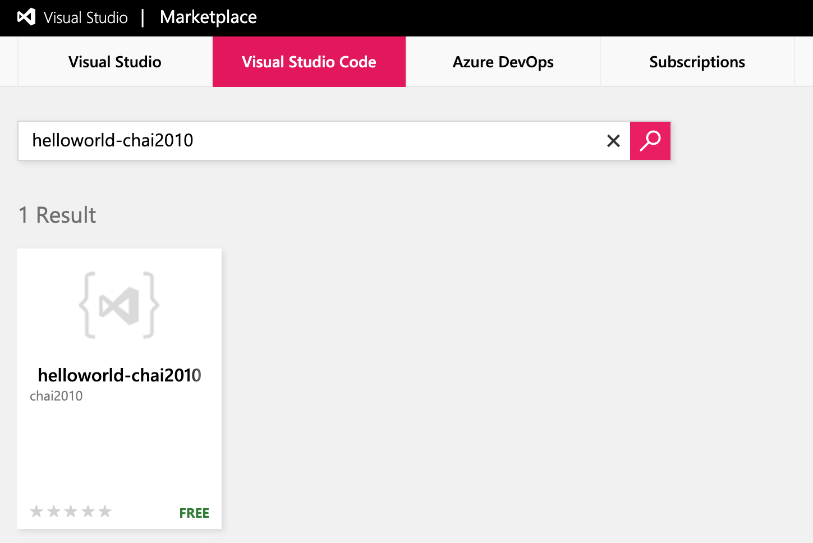

# 1.4 发布插件

VS Code 有个插件市场包含海量的插件和用户，因此插件开发完成本地内测完成后需要发布到插件市场。要发布到插件市场首先要科学上网完成注册并登录，如果没有账号也可以用Github账号登陆。插件市场地址为：[https://marketplace.visualstudio.com/vscode](https://marketplace.visualstudio.com/vscode)

在页面选择发布插件，会弹出插件上传到界面：

将之前打包 `helloworld-0.0.1.vsix` 文件上传，第一次可能出现以下错误：

插件市场发布的插件，必须要在`package.json`正确设置`publisher`为登陆的ID，同时插件的名字也需要唯一。这里发布者ID为`chai2010`，插件名称和显示名称也重新调整为`helloworld-chai2010`，配置修改后重新打包插件。

插件上传成功后的页面：

插件版本显示为`Verifying 0.0.1`表示插件平台还在验证插件的完整性。验证通过之后会变成绿色的钩，并且可以在插件市场检索到。如下图所示：

然后就可以通过VS Code正常流程安装插件了（安装前确保删除之前本地安装的插件，避免命令冲突）。

<!--
TODO: 安装的目录位置

Mac/Linux：${HOME}/.vscode/extensions
Windows系统：%USERPROFILE%\.vscode\extensions
-->
