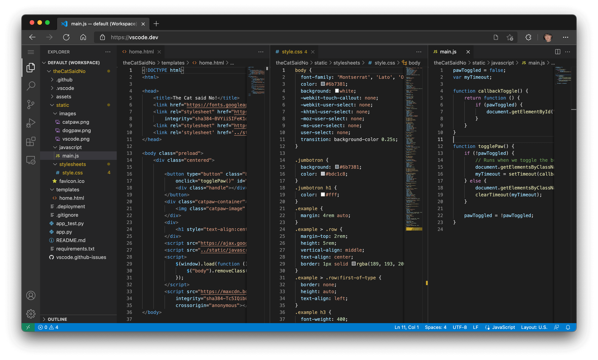
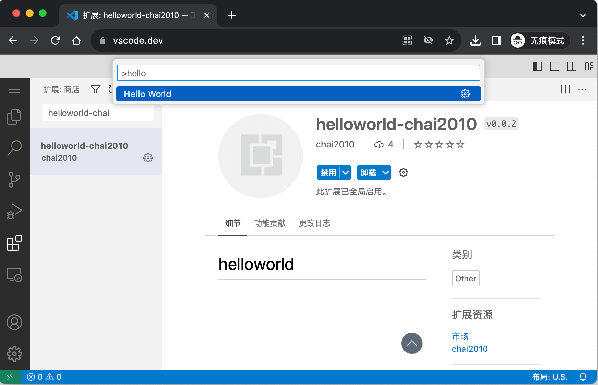

# 1.5 Web版插件

VS Code是基于Chrome内核构建的IDE，从诞生之日起很多人就在尝试将浏览器的能力带入其中——比如通过VS Code打开视频。如果反向思考会发现理论上VS Code似乎也是可以在Chrome中运行的，本节讨论浏览器环境的VS Code和插件。

## 1.5.1 浏览器中的 VS Code

浏览器中的VS Code在2021年底支持，可以通过 https://vscode.dev 或 https://github.dev 网址打开。下面是官方给出浏览器截图：



同时浏览器版的VS Code还带来了插件的能力，打通了和和Github仓库的对接。

## 1.5.2 插件增加 Web 版

浏览器环境比本地插件更为严格，它不能使用Node.js——也就不能访问本地的操作系统能力。此外Web版插件的入口和本地是分开的。现在我们将前一节的插件增加Web环境的支持。可以通过 `yo code` 生成一个 "New Web Extension (TypeScript)" 类型的工程。目前的例子比较简单，可以通过手工微调下 `package.json` 文件即可：

```json
{
  "version": "0.0.2",
  "main": "./extension.js",
  "browser": "./extension.js",
  ...
}
```

其中版本号做了升级（否则不方便上传），其次是通过`browser`属性指定Web版插件的入口。此外如果要在本地F5执行Web版插件还需要改下`.vscode/launch.json`文件：

```json
		{
			"name": "Run Web Extension ",
			"type": "extensionHost",
			"request": "launch",
			"args": [
				"--extensionDevelopmentPath=${workspaceFolder}",
				"--extensionDevelopmentKind=web"
			]
		},
```

针对Web插件启动VS Code时命令行增加一个`--extensionDevelopmentKind=web`参数。

## 1.5.3 重新打包上传

参考前一节操作流程重新打包得到 `helloworld-chai2010-0.0.2.vsix` 文件，然后在插件管理页面右键菜单选择更新：


上传后需要等待验证通过。然后打开 https://vscode.dev 页面，在插件视图安装插件并选择命令：



执行`Helloworld`命令后弹出信息：


## 1.5.4 小结

在云原生已经常态化的今天，通过浏览器打开VS Code进行软件开发并发布到云上已经是一个日常工作流程。在2023年6月VS Code官方发文开始支持WASI规范的WebAssembly，给大家带来了更大的想象空间。比如可以在纯浏览器的VS Code基于WASM技术实现编译和执行，从而支持日常开发。目前凹语言等面向WebAssembly的新型编程语言都在机遇VS Code开发在线的IDE。这是一个快速发展的领域，让我们拭目以待未来的发展。
