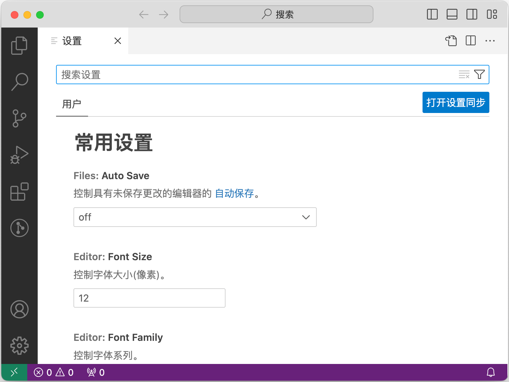
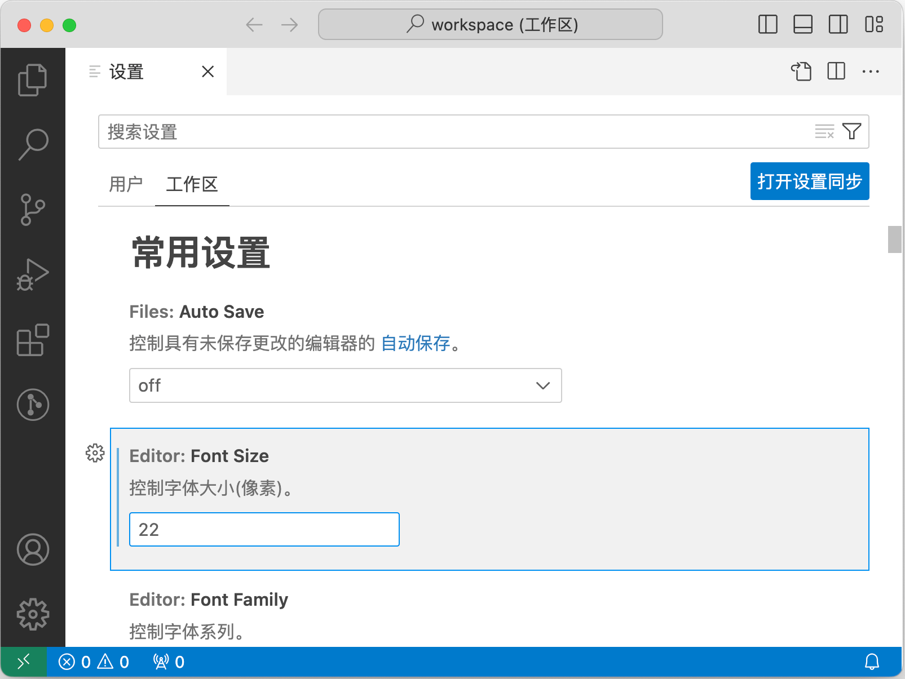
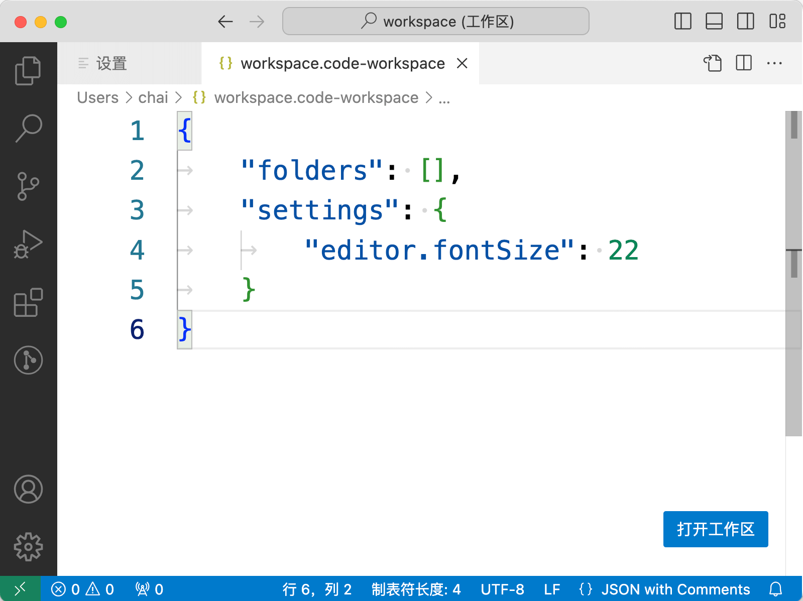
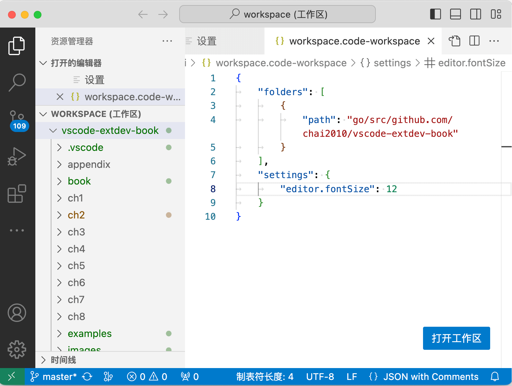
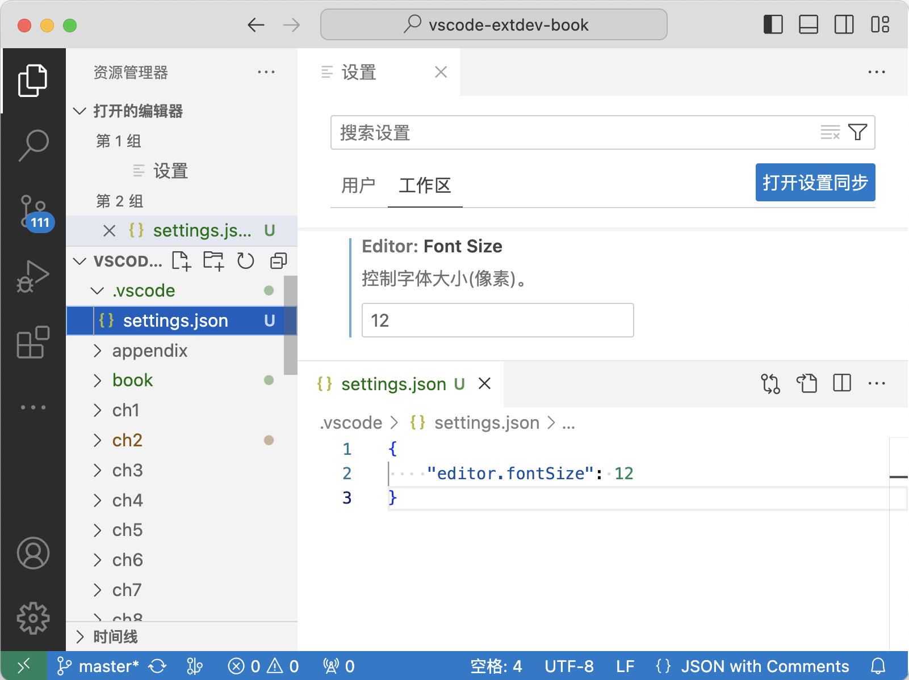

# 2.1 打开工作区

VS Code可以打开一个空窗口、打开一个或者多个文件、打开一个或多个目录，打开的路径最终都会组织到一个工作区空间下。本节我们查看不同打开模式对应的工作区差异。

## 2.1.1 认识工作区

命令行输入 `code` 或鼠标方式打开 VS Code 空窗口，然后通过菜单“首选项->配置”打开配置界面：



可以看到只有针对“用户”的配置，并无工作区相关的配置。

## 2.1.2 保存工作区

然后通过菜单“文件->将工作区另存为...”，保存为 `workspace.code-workspace`。工作区文件是JSON格式的，内容如下：

```json
{ "folders": [] }
```

其中有个 `folders` 属性用于记录打开的目录列表，目前还是空的。现在再重新打开配置界面：



可以看到现在除了“用户”配置，还多了一个针对“工作区”的配置。

## 2.1.3 工作区配置

我们将针对工作区的配置的默认字体大小从12改为22。然后用当前的VS Code空窗口打开`workspace.code-workspace`文件（这是JSON文件）：



可以发现编辑区的字体已经变大了。如果改动`editor.fontSize`对应的配置并保存，则可以看到编辑区字体的变化。

## 2.1.4 添加目录到工作区

虽然打开了一个工作区文件，但是工作区文件并无其他变化。如果我们此时通过菜单打开一个新的目录，那么将打开一个新的工作区窗口。由此可以推测工作区对应一个`*.code-workspace`命令的文件，或者是一个目录。

我们先通过菜单“文件->将文件夹添加到工作区...”，将本书目录加入：



可以发现左边“资源管理器”视图，在“WORKSPACE”工作区节点下多了一个“vscode-extdev-book”节点，对应刚刚添加到工作区的目录。右侧打开的`workspace.code-workspace`文件视图可发现，`folders`属性多了一个包含`path`属性的对象。

由此可以发现，VS Code的工作区其实有一系列目录组成，这些打开的目录共享一个工作区配置状态。

## 2.1.5 单目录工作区

平白多出一个工作区文件总是让人烦恼。很多时候我们只是简单打开一个文件或一个目录。当用VS Code打开一个目录是，该目录就是一个工作区：




单目录工作区和工作区文件在视觉上有2个差异：首先是“资源管理器”视图“vscode-extdev-book”是根节点；其次是工作区的配置文件为`.vscode/settings.json`。由此可见，如果要给工作区配置参数还是需要一个`.vscode`隐藏目录。

## 2.1.6 编辑工作区文件

其实也可以在某个目录显示创建`workspace.code-workspace`文件，然后通过鼠标双击该文件即可打开工作。工作区内容如下：

```json
{
	"folders": [
		{ "path": "." }
		// , { "path": "../.." }
	],
	"settings": {
		"editor.fontSize": 12
	}
}
```

将当前目录的相对路径`.`添加到工作区目录列表，也可以将其他目录的相对路径添加到列表。工作区文件是一种扩展的JSON格式，对于临时需要屏蔽的路径或参数直径注释掉即可。

这样可以在工作区窗口内通过VS Code实时编辑工作区文件调整目录列表。

<!--
https://code.visualstudio.com/docs/editor/workspaces
-->
