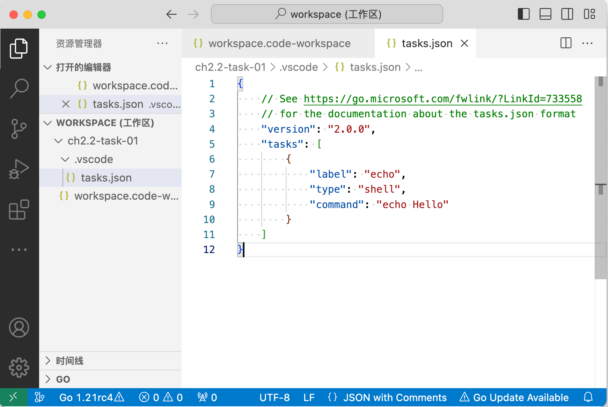

# 2.2 工作区Task

VS Code插件的目是为了自动化提效，但是提效并非只能通过插件实现，工作区Task也是一个很好用的提效工具。本节讨论Task的基本用法。

### 2.2.1 准备新工程区

在第一章中我们通过一个“Hello word”的例子快速展示了插件的生老病死的全部流程。现在我们尝试采用更简单的Task实现类似的功能。首先创建一个空目录，并在目录中创建`workspace.code-workspace`文件：

```json
{
	"folders": [
		{"path": "."}
	]
}
```

鼠标双击`workspace.code-workspace`文件打开新的工作区窗口。

### 2.2.2 新建Task

通过菜单“终端->配置任务...”呼出提示框，选择“使用模板创建task.json文件”：


然后选择“Others 运行任意外部命令的示例”


Task文件是组织在工作区某个目录下的，生成的是`./.vscode/task.json`文件：



生成的Task名为`echo`，是一个`shell`类型的命令`echo Hello`。

### 2.2.3 执行Task

通过菜单“终端->运行任务...”，选择当前目录下`echo`任务：


选择“继续而不扫描任务输出”，直接执行`echo`命令：


最终的输出结果如下：


我们通过Task的方式执行了shell环境的echo命令。

