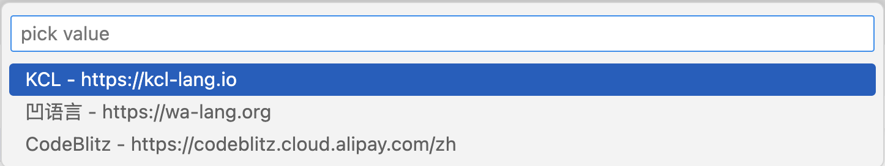

# 2.3 Task进阶

前一节展示了Task的基本用法和流程，本节我们尝试通过VS Code自身的能力简化Task启动，同时希望给Task增加更多的灵活性。

## 2.3.1 Task配置规范

task.js文件对应的数据结构由`TaskConfiguration`定义：

```ts
interface TaskConfiguration {
  version: '2.0.0';
  tasks?: TaskDescription[];
}
```

首先是Task文件对应的规范版本号，然后是`tasks`定义的任务列表（此外还有`windows`、`osx`、`linux`分别对应不同系统的任务）。每个Task由`TaskDescription`定义：

```ts
interface TaskDescription {
  label: string; // The task's name
  type: 'shell' | 'process';
  command: string;
  args?: string[];
  options?: CommandOptions;
  group?: 'build' | 'test' | { kind: 'build' | 'test'; isDefault: boolean };
  dependsOn?: string[];
}
```

前三个`label`、`type`、`command`是必须提供的，分别定义任务的名称、任务类型和对应的命令。可选的`args`定义命令行的参数，可选的`options`定义命令的上下文环境，可选的`group`定义分组（目前有`build`和`test`），`dependsOn`则定义Task之间的依赖关系。

命令后的上下文由`CommandOptions`定义：

```ts
export interface CommandOptions {
  cwd?: string;
  env?: { [key: string]: string };
}
```

主要是当前工作目录和环境变量。

## 2.3.2 MDBook工作流Task

本书采用 [MDBook](https://rust-lang.github.io/mdBook/) 构建，为了提高工作效率我们可以构建一个MDBook预览Task。具体需要以下流程：首先在仓库根目录命令行环境通过 `mdbook build` 命令构建出 `book` 子目录，然后用浏览器打开 `./book/index.html` 文件预览。因此我们先假定本地已经安装有 `mdbook` 命令。

配置 task.json 文件整体结构如下：

```json
{
    "version": "2.0.0",
    "tasks": [
        {
            "label": "mdbook-build",
            // 待补充
        },
        {
            "label": "mdbook-preview",
            // 待补充
        },
        {
            "label": "mdbook-clean",
            // 待补充
        }
    ]
}
```

每个Task的`label`指定其唯一的名字。分别有 `mdbook-build`/`mdbook-preview`/`mdbook-clean` 三个命令，分别对应构建、预览和清理三个常用操作。

#### 2.3.2.1 `mdbook-build` 命令

构建命令的常用形式为`mdbook build [dir]`，其中`[dir]`是可选的要构建的电子书根目录，如果省略目录则默认为当前目录。完整的命令配置如下：

```json
        {
            "label": "mdbook-build",
            "type": "shell",
            "command": "mdbook",
            "args": ["build", "${workspaceFolder}/../.."]
        },
```

Task的名字为`mdbook-build`，依然是一个shell命令：`command`指定命令，`args`指定参数列表。参数中的`${workspaceFolder}`是VS Code的内置变量，表示当前工作区的根目录。

#### 2.3.2.2 `mdbook-preview` 命令

预览是通过本地命令打开默认的浏览器，打开构建后的页面完成。命令配置如下：

```json
        {
            "dependsOn": ["mdbook-build"],
            "label": "mdbook-preview",
            "type": "shell",
            "osx": {
                "command": "open",
                "args": [
                    "${workspaceFolder}/../../book/index.html"
                ]
            },
            "linux": {},
            "windows": {},
        }
```

其中`dependsOn`该任务依赖`mdbook-build`任务完成构建。然后通过`osx`指定macOS系统下的打开浏览器的命令，另外的`linux`和`windows`系统的打开浏览器的方式可以参考代码。

#### 2.3.2.3 `mdbook-clean` 命令

清楚命令是删除构建生成的`book`命令，任务的配置参数如下：

```json
        {
            "label": "mdbook-clean",
            "type": "shell",
            "command": "rm",
            "args": ["-rf", "${workspaceFolder}/../../book"]
        }
```

这里使用的是`rm`命令只能在macOS和Linux等类UNIX系统工作，windows下的配置读者可以自行完善。

### 2.3.3 常用配置变量

在前面的Task中，我们通过`${workspaceFolder}`内置变量来定位工作区目录，然后再通过相对路径来指定参数的路径。为了方便VS Code预定义了一组常用的配置变量，下面是比较常用的部分：

- `${userHome}` - 用户主文件夹的路径
- `${workspaceFolder}` - 在 VS Code 中打开的文件夹的路径
- `${file}` - 当前打开的文件
- `${fileWorkspaceFolder}` - 当前打开文件的工作区文件夹
- `${cwd}` - VS Code 启动时任务运行器的当前工作目录
- `${lineNumber}` - 活动文件中当前选定的行号
- `${selectedText}` - 活动文件中当前选定的文本
- `${execPath}` - 正在运行的 VS Code 可执行文件的路径

我们不仅仅可以获取工作区目录路径，还可以获得当前打开的文件路径、当前打开文件对应的工作区路径、以及当前光标位置等信息。

除了工作区相关的配置，VS Code配置参数也可以通过`${config:Name}`的形式获取。比如`${config:editor.fontSize}`对应字体大小，以下命令打印当前配置的字体大小：

```json
        {
            "label": "echo-fontSize",
            "type": "shell",
            "command": "echo",
            "args": ["fontSize:", "${config:editor.fontSize}"]
        },
```

这些预定义的配置变量不仅仅可以在Task中使用，也可以在后续的插件开发中使用。

### 2.3.4 用户自定义环境变量

在前面几个Task中，`${workspaceFolder}/../..`路径出现了多次，是否可以通过定义一个中间配置变量来减少重复代码呢？我们可以通过自定义环境变量来实现类似的效果：

```json
{
    "version": "2.0.0",
    "options": {
        "env": {
            "BOOK_ROOT": "${workspaceFolder}/../.."
        }
    },
    "tasks": [
        {
            "label": "mdbook-build",
            "type": "shell",
            "command": "mdbook",
            "args": ["build", "${BOOK_ROOT}"]
        },
        {
            "dependsOn": ["mdbook-build"],
            "label": "mdbook-preview",
            // ...省略...
        },
        {
            "label": "mdbook-clean",
            "type": "shell",
            "command": "rm",
            "args": ["-rf", "${BOOK_ROOT}/book"]
        },
    ]
}
```

在`options`和`env`属性定义环境变量`BOOK_ROOT`，环境变量的值依然可以使用VS Code预定义的配置变量。然后在Task的命令参数中通过`${BOOK_ROOT}`引用环境变量，可以通过这种方式尝试减少冗余代码。

### 2.3.5 Task的输入参数

有时候需要在Task执行时有用户输入一些参数，VS Code提供了输入框、下拉列表选择和命令集成等方式。比如下面的Task分别通过输入字符串和下拉列表获取参数，然后通过`echo`输出信息：

```json
{
    "version": "2.0.0",
    "inputs": [
        {
            "id": "str",
            "type": "promptString",
            "description": "str input"
        },
        {
            "id": "pick-value",
            "type": "pickString",
            "description": "pick value",
            "options": [
                "KCL - https://kcl-lang.io",
                "凹语言 - https://wa-lang.org",
                "CodeBlitz - https://codeblitz.cloud.alipay.com/zh"
            ],
        }
    ],
    "tasks": [
        {
            "label": "echo-str",
            "type": "shell",
            "command": "echo ${input:str}",
        },
        {
            "label": "echo-pick-value",
            "type": "shell",
            "command": "echo ${input:pick-value}",
        },
    ]
}
```

执行时输入效果如下：




输入字符串时还可以通过设置`password`来隐藏输入框的字符：

```json
        {
            "id": "password",
            "type": "promptString",
            "description": "input password",
            "password": true
        }
```

输入密码的效果如下：


<!--

### 2.3.6 绑定快捷键和菜单

https://code.visualstudio.com/docs/editor/tasks

https://code.visualstudio.com/docs/editor/tasks-appendix

https://github.com/microsoft/vscode/issues/108051

-->
