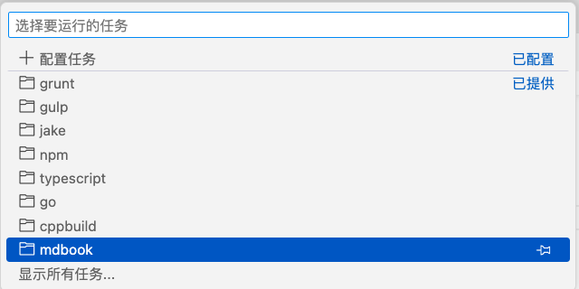
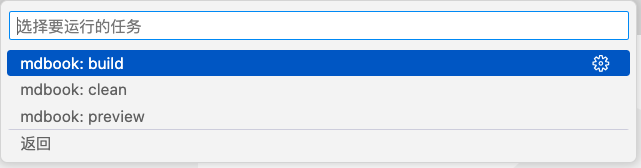

# 2.4 Task插件

Task是一个可以用于定制处理流程的特性，特别是可以在不用写代码就能完成定制，可以完成类似Makefile的功能。本节我们将尝试如果通过插件编程来扩展Task的功能。

## 2.4.1 MDBook插件定制

VS Code针对常用的Go、Node.js、Ruby、TypeScript等语言都定制了配套的Task。特别是工作区对应某种类型的语言时，内置的插件系统会自动注册相应的Task。我们也可以通过Task插件给MDBook也实现类似的功能。

最终效果是对应一组MDBook的Task，如图所示：



点击后可以看到mdbook类型的Task下有build、preview和clean三个功能：



因为是新的类型，也可以在`.vscode/tasks.json`配置：

```json
{
	"version": "2.0.0",
	"tasks": [
		{
			"label": "mdbook: build",
			"type": "mdbook",
			"task": "build"
		}
	]
}
```

这是用户视角的MDBook插件的效果。

## 2.4.2 `package.json`增加Task规范

要定义新的mdbook插件类型需要下定义其规范，对应的task有哪些功能和属性等。`contributes`部分如下：

```json
{
  // 基础配置和其他插件类似
  "contributes": {
    "taskDefinitions": [
      {
        "type": "mdbook",
        "required": [ "task" ],
        "properties": {
          "task": {
            "type": "string",
            "description": "The mdbook task",
            "examples": ["build", "preview", "clean"]
          }
        }
      }
    ]
  }
}
```

在贡献点的`taskDefinitions`属性增加了`mdbook`新类型（依赖基础的`task`）：其中有一个`task`属性，有build、preview和clean三个功能。

另外在`activationEvents`配置插件激活的事件：

```json
{
  "activationEvents": [
    "onCommand:workbench.action.tasks.runTask"
  ]
}
```

当运行Task命令时插件被激活。

## 2.4.3 插件注册和销毁代码

插件的入口和销毁函数实现如下：

```js
const vscode = require('vscode');
const pkg = require("./mdbookTaskProvider");

function activate(context /** @param {vscode.ExtensionContext} */) {
	const workspaceRoot = vscode.workspace.workspaceFolders[0].uri.fsPath;

	mdbookTaskProvider = vscode.tasks.registerTaskProvider(
		pkg.MdbookTaskProvider.MdbookType,
		new pkg.MdbookTaskProvider(workspaceRoot)
	);
}

function deactivate() {
	if (mdbookTaskProvider) {
		mdbookTaskProvider.dispose();
	}
}
```

在`activate`函数先获取工作区路径，然后通过`vscode.tasks.registerTaskProvider`注册新的插件类型。新的插件动力由`MdbookTaskProvider`类实现，在`mdbookTaskProvider.js`文件定义：

```js
class MdbookTaskProvider {
	static MdbookType = 'mdbook';

	/** @type {string} */
	workspaceRoot = undefined;

	/** @type {Thenable<vscode.Task[]> | undefined} */
	mdbookPromise = undefined;

	constructor(workspaceRoot /** @param {string} */) {
		this.workspaceRoot = workspaceRoot;
	}

	provideTasks() {
		if(!this.mdbookPromise) {
			this.mdbookPromise = this.getTasks();
		}
		return this.mdbookPromise;
	}
	resolveTask(_task) {
		return undefined;
	}
}
```

Task的Provider实现必须提供`provideTasks`和`resolveTask`两个方法，分别用于构造和修复用户要执行的Task。查看`provideTasks`实现可以看到`this.mdbookPromise`记录全部的task对象，由`this.getTasks()`方法初始化。

`getTasks`方法实现如下：

```js
	getTasks() {
		const buildTask = new vscode.Task(
			{type: 'mdbook', task: 'build'}, // kind
			vscode.TaskScope.Workspace,      // scope
			'build',                         // name
			'mdbook',                        // source
			new vscode.ShellExecution(`mdbook build`), // execution
			`mdbook_build`
		);

		const previewTask = new vscode.Task(...);
		const cleanTask= new vscode.Task(...);

		return [buildTask, previewTask, cleanTask];
	}
```

定义好每个task，然后作为列表返回。每个task可以绑定执行的命令，比如`vscode.ShellExecution("mdbook build")`等价于执行一个`mdbook build`命令（也可以自定义扩展命令）。

## 2.4.4 插件输出信息

如果在使用Task的过程中输出一些信息，可以通过`vscode.OutputChannel`功能实现。比如：

```js
/**@type {vscode.OutputChannel} */
let _channel = null;

/** @return {vscode.OutputChannel} */
function getOutputChannel()  {
	if (!_channel) {
		_channel = vscode.window.createOutputChannel('Mdbook Task Provider');
	}
	return _channel;
}

function activate(context /** @param {vscode.ExtensionContext} */) {
	const workspaceRoot =
		vscode.workspace.workspaceFolders && vscode.workspace.workspaceFolders.length > 0
		? vscode.workspace.workspaceFolders[0].uri.fsPath
		: undefined;
	if (!workspaceRoot) {
		getOutputChannel().appendLine('Mdbook task provider requires a workspace root.');
		getOutputChannel().show(true);
		return;
	}
	...
}
```

如果缺少工作区就不注册Task类型，并输出提示信息。

## 2.4.5 插件感知

最好的插件是不用的时候感觉不到它的存在，在需要的时候自然就出现了。可以在插件代码中识别工作区的某些特征，然后针对性提供功能。另外在不同的操作系统环境，也可以提供更本地化的功能。

<!--
https://code.visualstudio.com/api/extension-guides/task-provider

https://github.com/microsoft/vscode-extension-samples/tree/main/task-provider-sample
https://github.com/athackst/vscode-ament-task-provider

https://github.com/Microsoft/vscode/issues/71089
-->
