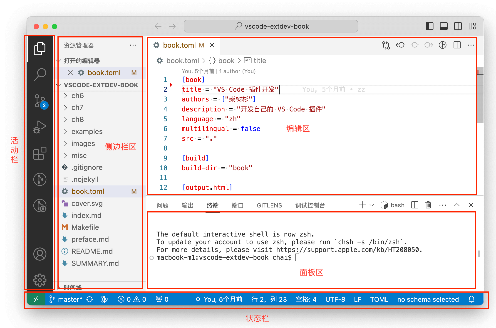

# 3.1 工作台简介

VS Code虽然是一个轻量的IDE开发环境，但是其最核心的功能依然是代码编辑器。VS Code采用和其他代码编辑器类似的布局结构，其默认的工作台界面如下图：

- 活动栏：左侧是一个活动栏，基础图标依次为资源管理器、搜索、源代码管理、运行和调试、扩展，后面是插件的扩展部分。
- 侧边栏：与活动栏强关联的是侧边栏区，每个活动栏的图标都有不同的侧边栏视图。
- 编辑器：右侧的上部是VS Code的代码编辑区，可以根据需要拆分为多个子编辑和视图窗口。
- 面板：编辑器区域下方用于查看视图的附加面板空间。默认包含输出、调试信息、错误和警告以及集成终端。
- 状态栏：底部长条是状态栏，有关打开的项目和编辑的文件的信息。

通过VS Code提供的一系列API，插件可以对用户界面进行扩展和定制。此外，VS Code还可以通过主题扩展工作台的颜色。

