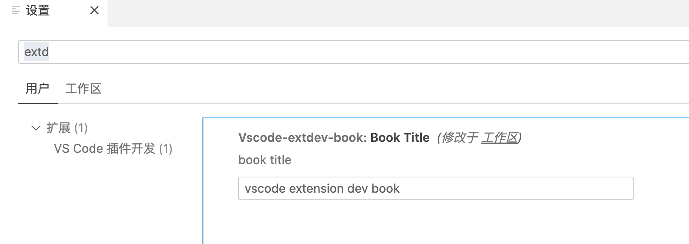

# 3.2 配置和存储

本章主题虽然是工作台等界面有关的内容，但是他们都和配置密切相关，比如第2章的例子通过工作区配置设置字体的大小。VS Code提供了包括配置、插件数据存储等多种存储方式，本节则是从插件视角讨论配置和存储的内容。

## 3.2.1 配置项

每个插件可以创建一个专属设置项，这个配置项会出现在设置界面展示。修改`package.json`文件，在`contributes`贡献点属性增加一个`configuration`配置：

```json
{
    "contributes": {
        "configuration": {
           "type": "object",
           "title": "VS Code 插件开发",
           "properties": {
               "vscode-extdev-book.bookTitle": {
                   "type": "string",
                   "default": "vscode extension dev book",
                   "description": "book title"
               }
            }
        }
    }
}
```

我们增加了一个“VS Code 插件开发”类型的配置，配置只有一个标题信息。效果如下：



在配置的“扩展类别”下可以找到插件的专属配置。VS Code为基础类型的配置提供的友好的界面编辑支持。同时VS Code也提供配置相关的API，`vscode.workspace`名字空间提供了`getConfiguration`函数返回配置对象：

```js
namespace workspace {
    function getConfiguration(section?: string, scope?: ConfigurationScope): WorkspaceConfiguration;
}
```

`getConfiguration`返回的`WorkspaceConfiguration`对象定义如下：

```ts
export interface WorkspaceConfiguration {
    readonly [key: string]: any;

    has(section: string): boolean;
    get<T>(section: string): T | undefined;
    get<T>(section: string, defaultValue: T): T;
    update(section: string, value: any, /* 省略 */ ): Thenable<void>;
}
```

其中`key`说明可以直接安装字典的方式读取，同时提供了类型安全的`get`等价方法。`has`判断配置是否存在，`update`更新配置。

为了便于测试，可以增加两个命令分别进行读和更新：

```js
    context.subscriptions.push(vscode.commands.registerCommand('extdev.showConfig', () => {
        const config = vscode.workspace.getConfiguration();
        const bookTitle = config.get('vscode-extdev-book.bookTitle');
        vscode.window.showInformationMessage(`bookTitle: ${bookTitle}`);
    }));
	context.subscriptions.push(vscode.commands.registerCommand('extdev.updateConfig', () => {
		const config = vscode.workspace.getConfiguration();
		config.update('vscode-extdev-book.bookTitle', "《VS Code插件开发》")
	}));
```

首先`vscode.workspace.getConfiguration()`获取配置对象，然后通过`vscode-extdev-book.bookTitle`配置的全局唯一ID来读取和修改。

另外可以通过`vscode.workspace.onDidChangeConfiguration()`监听全局配置的变化。下面的代码监听并过滤当前插件的配置变化：

```js
	const lastBookTitle = vscode.workspace.getConfiguration().get('vscode-extdev-book.bookTitle');
	context.subscriptions.push(vscode.workspace.onDidChangeConfiguration(() => {
		const config = vscode.workspace.getConfiguration();
		const bookTitle = config.get('vscode-extdev-book.bookTitle');
		if(lastBookTitle != bookTitle) {
			vscode.window.showInformationMessage(`bookTitle changed: ${bookTitle}`);
			lastBookTitle = bookTitle;
		}
	}));
```

这样就实现了对插件配置的精确监听。

## 3.2.2 插件的数据存储

配置数据一般是比较固定且静态的，如果是运行时的插件状态数据可以通过`workspaceState`或`globalState`存储。他们在工作区定义如下：

```js
namespace workspace {
    readonly workspaceState: Memento;
    readonly globalState: Memento & {
        setKeysForSync(keys: readonly string[]): void;
    };
}
```

状态对象都是`Memento`对象类型，全局状态多了一个同步的更新操作。`Memento`定义如下：

```js
interface Memento {
	keys(): readonly string[];
	get<T>(key: string): T | undefined;
	get<T>(key: string, defaultValue: T): T;
	update(key: string, value: any): Thenable<void>;
}
```

是一个和`WorkspaceConfiguration`配置对象类似的接口，提供了遍历和读写的支持。具体的测试例子可以参考配置部分代码，不再赘述。

## 3.2.3 小结

本节讨论了配置项和状态两种不同的数据存储，配置项用于人可读易于编辑的数据管理，状态主要用于运行时需要的复杂数据结构的管理。这两种方式都可以保证在VS Code重启时数据不会丢失。

