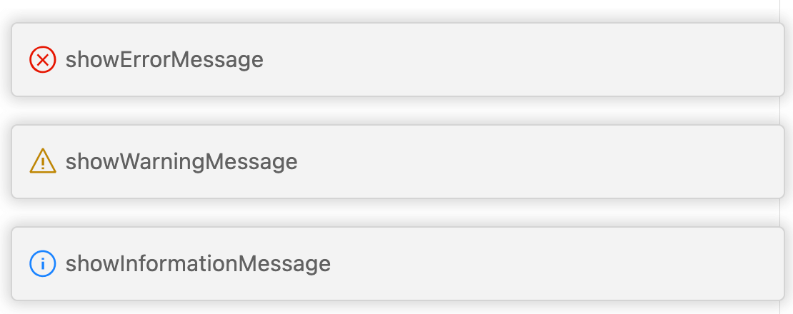
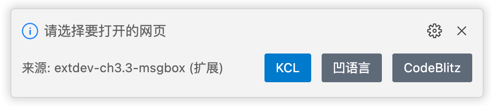
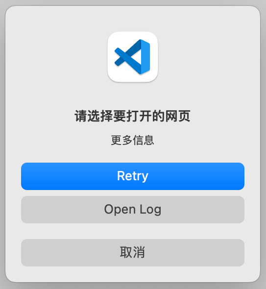
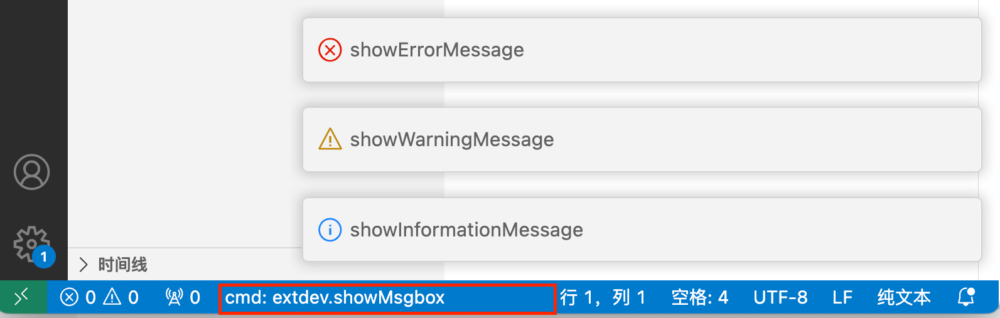

# 3.3 通知和状态栏

程序开发中和显示通知信息时可以通过通知消息框或状态栏显示。本节展示通知和状态栏的基本用法。

## 3.3.1 通知消息

VS Code提供了普通信息、警告信息、错误信息三种通知消息显示框，对应以下几个函数：

```ts
namespace windows {
	function showInformationMessage(message: string);
	function showWarningMessage(message: string);
	function showWarningMessage(message: string);
}
```

他们的显示效果如图：



三种类型消息函数的API几乎是一样，主要是图标的区别。

## 3.3.2 消息框的返回值

除了基本用法，这些函数还支持定制可选的值并返回值。重载函数的签名如下：

```ts
function showInformationMessage(
	message: string, ...items: string[]
): Thenable<string | undefined>;
```

可以通过返回值判断不同的字符串输入，下面是从“KCL”、“凹语言”、“CodeBlitz”三个中选择一个打开：

```js
	context.subscriptions.push(vscode.commands.registerCommand('extdev.openPage', () => {
		vscode.window.showInformationMessage(
			'请选择要打开的网页',
			"KCL", "凹语言", "CodeBlitz"
		).then(result => {
			if(result === 'KCL') {
				child_process.exec(`open 'https://kcl-lang.io'`);
			} else if (result == '凹语言') {
				child_process.exec(`open 'https://wa-lang.org'`);
			}else  {
				child_process.exec(`open 'https://codeblitz.cloud.alipay.com/zh'`);
			}
		});
	}));
```

获取返回值后通过Node.js的`child_process.exec`调用本地的`open`命令在浏览器打开网站。这个例子只能在Linux或macOS本地环境使用。下面是显示效果：



## 3.3.3 消息框模态

除了指定可选择输入项，还可以设置窗口的显示模式，对应重载函数的签名如下：

```ts
export interface MessageOptions {
	modal?: boolean;
	detail?: string;
}

export interface MessageItem {
	title: string;
	isCloseAffordance?: boolean;
}

function showInformationMessage(
	message: string, options: MessageOptions, ...items: MessageItem[]
): Thenable<MessageItem | undefined>;
```

`MessageOptions`可以设置模式窗口还是非模式，还有详细的说明信息。`MessageItem`则是每个选项的更信息。以下是演示代码：

```js
	context.subscriptions.push(vscode.commands.registerCommand('extdev.showMsgboxOpt', () => {
		vscode.window.showInformationMessage(
			'请选择要打开的网页', {'modal':true, 'detail': "更多信息"},
			{"title":"Retry"}, {"title":"Open Log"}
		).then(result => {
			console.log(`result: ${result.title}`);
		});
	}));
```

显示效果如下：



## 3.3.4 设置状态栏

除了弹出提示框，状态栏也是一个比较灵活的显示窗口。比如默认的状态栏可以实时显示编辑的光标位置，文件编码、类别等信息。可以通过`setStatusBarMessage`函数实现：

```ts
namespace windows {
	function setStatusBarMessage(text: string): Disposable;
	function setStatusBarMessage(text: string, hideAfterTimeout: number): Disposable;
}
```

下面在命令执行的时候显示命令，3秒钟后隐藏：

```js
	context.subscriptions.push(vscode.commands.registerCommand('extdev.showMsgbox', () => {
		vscode.window.setStatusBarMessage('cmd: extdev.showMsgbox', 3000);
		...
	}));
```

显示效果如下：



更为复杂的状态栏定制可以通过`vscode.window.createStatusBarItem`来完成，这里不再展开。

## 3.3.5 小结

消息框和状态栏是用户显示信息的常用手段，而且使用方式比较独立，可以把他们理解为传统编程语言中的`print`类似功能单带界面的函数。

