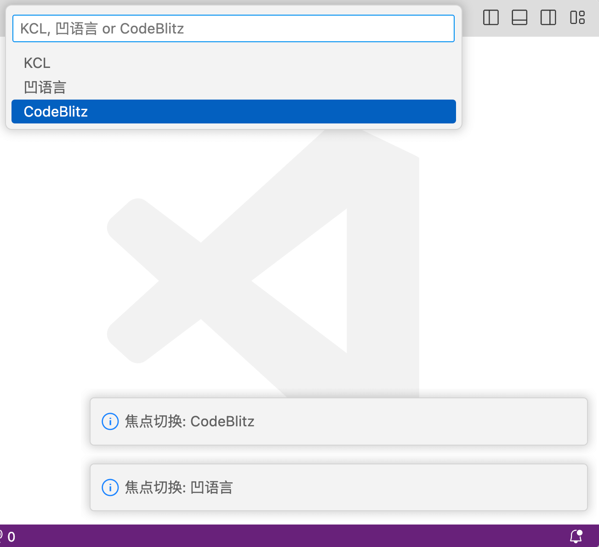
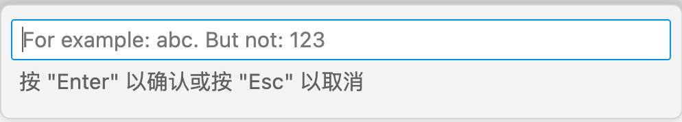
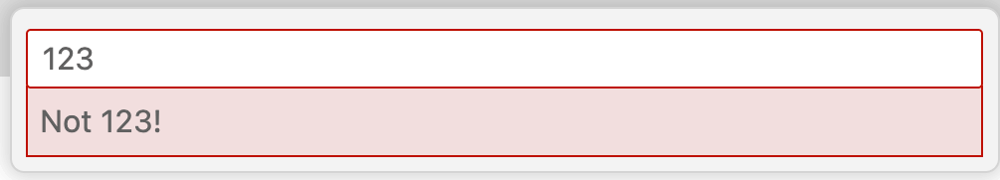
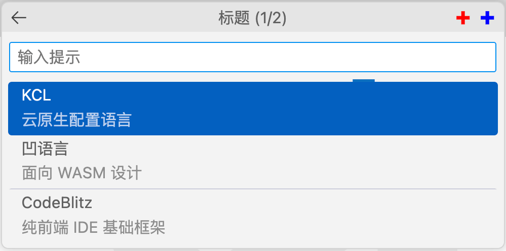

# 3.4 常用输入框

输入信息是软件和人交换的必要手段，通过界面可以极大改进用户的输入体验。本节讨论常用输入框的使用。

## 3.4.1 列表输入框

最简单的是列表输入框，在2.3.5节我们已经见过Task的配置输入参数采用的列表输入的方式。列表可以通过`vscode.window.showQuickPick()`函数实现，其签名如下：

```ts
interface QuickPickOptions {
    title?: string;
    placeHolder?: string;
    onDidSelectItem?(item: QuickPickItem | string): any;
    // 其他省略
}

function showQuickPick(
    items: readonly string[],
    options?: QuickPickOptions
): Thenable<string>;
```

第一个参数是列表选项，第二个参数是`QuickPickOptions`类型表示输入框的各种配置。配置中比较常用的有`title`标题、`placeHolder`输入提示和`onDidSelectItem`切换选择时的回调函数等。

下面是一个例子：

```js
function activate(context) {
    context.subscriptions.push(
        vscode.commands.registerCommand('extdev.showQuickPick', () => {
            vscode.window.showQuickPick(
                ['KCL', '凹语言', 'CodeBlitz'],
                {
                    placeHolder: 'KCL, 凹语言 or CodeBlitz',
                    onDidSelectItem: item =>
                        vscode.window.showInformationMessage(
                            `焦点切换: ${item}`
                        )
                }
            ).then((result) => {
                vscode.window.showInformationMessage(`选中: ${result}`);
            });
        })
    );
}
```

显示效果如下：



## 3.4.2 通用输入框

列表适合有固定选择的输入项。如果是更普通的输入，可以用`vscode.window.showInputBox()`函数，其函数签名如下：

```ts 
interface InputBoxOptions {
    title?: string;
    value?: string;
    placeHolder?: string;
    password?: boolean;
    validateInput?(value: string): string;
    // 其他省略
}

function showInputBox(options?: InputBoxOptions): Thenable<string>;
```

因为没有后续列表项，参数主要是`InputBoxOptions`配置信息，其标题、默认值和提示信息等基础内容和`QuickPickOptions`相似。但是输入框不仅仅可以设置密码输入模式，还可以通过`validateInput`函数验证输入的合法性。

下面是一个例子：

```js
function activate(context) {
    context.subscriptions.push(
        vscode.commands.registerCommand('extdev.showInputBox', () => {
            vscode.window.showInputBox({
                value: 'abc',
                placeHolder: 'For example: abc. But not: 123',
                validateInput: text => {
                    vscode.window.showInformationMessage(`Validating: ${text}`);
                    return text === '123' ? 'Not 123!' : null;
                }
            }).then((result) => {
                vscode.window.showInformationMessage(`Got: ${result}`);
            });
        })
    );
}
```

显示效果如下：




遇到无效的输入：



## 3.4.3 认识 `QuickInput` 对象

`showQuickPick`和`showInputBox`都属于包装的用户更友好的API，但是缺乏一定的灵活性。他们底层都是通过`createQuickPick`个`createInputBox`两个函数实现，返回的是`QuickPick`和`InputBox`对象，这两个对象的基类都是`QuickInput`对象。`QuickInput`对象的定义如下：

```ts
interface QuickInput {
    title: string | undefined;      // An optional title.
    step: number | undefined;       // An optional current step count.
    totalSteps: number | undefined; // An optional total step count.

    // If the UI should allow for user input. Defaults to true.
    enabled: boolean;
    // If the UI should show a progress indicator. Defaults to false.
    busy: boolean;
    // If the UI should stay open even when loosing UI focus. Defaults to false.
    ignoreFocusOut: boolean;

    show(): void;
    hide(): void;
    onDidHide: Event<void>;
    dispose(): void;
}
```

属性部分主要有`title`标题信息和`step`、`totalSteps`表示的第几步骤等信息。方法部分主要是显示和隐藏控制、隐藏时的回调函数和释放资源。

下面是派生出来的`QuickPick`和`InputBox`对象：

```ts
interface QuickPick<T extends QuickPickItem> extends QuickInput {
    // Current value of the filter text.
    value: string;

    // Optional placeholder shown in the filter textbox when no filter
    // has been entered.
    placeholder: string | undefined;

    // Items to pick from. This can be read and updated by the extension.
    items: readonly T[];

    // An event signaling when the selected items have changed.
    readonly onDidChangeSelection: Event<readonly T[]>;

    // 更多信息暂省略
}

interface InputBox extends QuickInput {
    // Current input value.
    value: string;

    // Optional placeholder shown when no value has been input.
    placeholder: string | undefined;

    // If the input value should be hidden. Defaults to false.
    password: boolean;

    // An event signaling when the value has changed.
    readonly onDidChangeValue: Event<string>;
    // An event signaling when the user indicated acceptance of the input value.
    readonly onDidAccept: Event<void>;

    // 更多信息暂省略
}
```

`QuickInput`无法直接创建，只能创建派生的`QuickPick`和`InputBox`对象：

```ts 
function createQuickPick<T extends QuickPickItem>(): QuickPick<T>;
function createInputBox(): InputBox;
```

我们以`QuickPick`为例展示如何用底层API创建，首先是封装一个`myShowQuickPick`函数：

```js
/**
 * @param {string[]} items
 * @returns vscode.Thenable<string|undefined>
 */
function myShowQuickPick(items) {
    const quickPick = vscode.window.createQuickPick();
    quickPick.items = items.map(label => ({label}));
    quickPick.show();

    return Promise.race([        
        new Promise(c => quickPick.onDidChangeSelection((selection) => {
            if (selection[0]) {
                c(selection[0].label);
            } else {
                c(undefined);
            }
            quickPick.hide();
        })),
        new Promise(c => quickPick.onDidAccept(() => {
            c(quickPick.value);
            quickPick.hide();
        })),
        new Promise(c => quickPick.onDidHide(() => {
            c(undefined);
        }))
    ]);
}
```

其中比较关键的地方是返回一个`Promise`对象，其中包含了`onDidChangeSelection`表示点列表项输入、`onDidAccept`表示点键盘输入和窗口隐藏任何一种输入形式的结果。

下面是通过命令使用`myShowQuickPick`例子的效果：

```js
/** @param {vscode.ExtensionContext} context */
function activate(context) {
    context.subscriptions.push(
        vscode.commands.registerCommand('extdev.createQuickPick', () => {
            myShowQuickPick(
                ['KCL', '凹语言', 'CodeBlitz']
            ).then(result => {
                vscode.window.showInformationMessage(`result: ${result}`);
            });
        })
    );
}
```

这样就可以跟着特定的需要封装功能，同时达到类似`vscode.window.showQuickPick()`易用性。

## 3.4.4 QuickPick 输入框定制

QuickPick 输入框内置了很多功能，下面是一个效果图：



首先首先通过`scode.window.createQuickPick()`函数创建并显示：

```js
function activate(context) {
    const quickPick = vscode.window.createQuickPick();
    quickPick.show();

    ...
}
```

然后设置标题、总步骤数、输入提示和忙碌状态：

```js
    quickPick.title = "标题";
    quickPick.step = 1; // 从 1 开始
    quickPick.totalSteps = 2;

    // 输入的值为空时显示
    quickPick.placeholder = "输入提示";

    // 会出现一个处理或加载的动画, 其他不影响
    quickPick.busy = true;
```

定制左边是会退按钮，右边是自定义按钮：

```js
    /** @type {vscode.QuickInputButton} */
    const btnRedAdd = {
        "iconPath":vscode.Uri.file(context.asAbsolutePath('icon-add-red.svg')),
        "tooltip": "红色图标"
    };

    /** @type {vscode.QuickInputButton} */
    const btnBlueAdd = {
        "iconPath": vscode.Uri.file(context.asAbsolutePath('icon-add-blue.svg')),
        "tooltip": "蓝色图标"
    };

    quickPick.buttons = [
        vscode.QuickInputButtons.Back,
        btnRedAdd, btnBlueAdd
    ];
```

然后是下拉列表项，包含分组分割线：

```js
    // 下拉列表, 依然可以手工输入
    quickPick.items = [
        {'label': 'KCL', 'detail':'云原生配置语言'},
        {'label': '凹语言', 'detail':'面向 WASM 设计'},
        {kind: vscode.QuickPickItemKind.Separator}, // 分隔符
        {'label': 'CodeBlitz', 'detail':'纯前端 IDE 基础框架'}
    ];
```

然后是设置必要的消息处理函数后，就可以运行了。

## 3.4.5 小结

本节讨论的`QuickInput`输入框是定制性比较强的输入UI组件，可以容易实现多步骤输入等深度定制的特性，用户可以根据自己需要同时借鉴社区场景的代码方式再自行探索。
