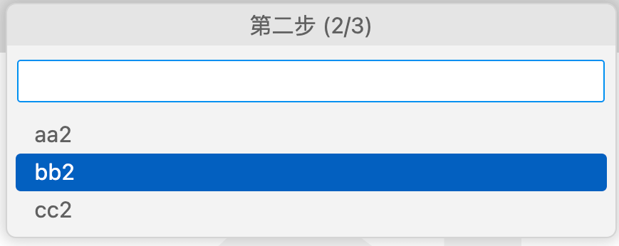

# 3.5 多步骤输入框

多步骤输入框是比较常用也比较复杂的问题，VS Code的`QuickInput`等提供了界面实现。本节我们讨论多步骤输入框的实现。

## 3.5.1 最简实现

先看一个最简单实现，先封装一个`showMultiStepQuickPick`，其中参数部分包含了多步骤输入框基本参数：

```js
/**
 * @param {string} title
 * @param {number} step
 * @param {number} totalSteps
 * @param {string[]} items
 * @returns vscode.Thenable<string|undefined>
 */
function showMultiStepQuickPick(title, step, totalSteps, items) {
    const quickPick = vscode.window.createQuickPick();
    quickPick.items = items.map(label => ({label}));
    quickPick.title = title;
    quickPick.step = step;
    quickPick.totalSteps = totalSteps;
    quickPick.show();

    return Promise.race([
        new Promise(c => quickPick.onDidChangeSelection((selection) => {
            c(selection[0].label);
            quickPick.hide();
        })),
        new Promise(c => quickPick.onDidAccept(() => {
            c(quickPick.value);
            quickPick.hide();
        })),
        new Promise((_, reject) => quickPick.onDidHide(() => {
            reject(undefined);
        }))
    ]);
}
```

其中 `onDidChangeSelection` 表示列表选择输入，`onDidAccept` 表示输入框文本输入，以上输入正常输入后先标记 `Promise` 为正常完成状态，然后调用隐藏输入框。因为 `Promise` 只会被触发一次，当第一次出发为 `onDidHide` 信息时表示拒绝状态。

然后通过`Promise`封装3个顺序的异步代码：

```js
/** @param {vscode.ExtensionContext} context */
function activate(context) {
    context.subscriptions.push(
        vscode.commands.registerCommand('extdev.multiStepInput', () => {
            const totalSteps = 3;
            showMultiStepQuickPick(
                '第一步', 1, totalSteps, ["aa1", "bb1", "cc1"]
            ).then(result1 => {
                showMultiStepQuickPick(
                    '第二步', 2, totalSteps, ["aa2", "bb2", "cc2"]
                ).then(result2 => {
                    showMultiStepQuickPick(
                        '第三步', 3, totalSteps, ["aa3", "bb3", "cc3"]
                    ).then(result3 => {
                        vscode.window.showInformationMessage(
                            `${result1} -> ${result2} -> ${result3}`
                        );
                    });
                });
            });
        })
    );
}
```

以下是执行效果图：



但是这个多步骤输入功能非常不稳健：不能后退也没有中间退出机制——输入的交互非常生硬。

## 3.5.2 `async` 和 `await` 语法糖

async/await 是ES2017标准引入的，使得我们可以像写同步代码的风格写异步代码。对于返回 `Promise` 的函数，加上 `async` 关键字就可以。比如下面是`async`版本的`showMultiStepQuickPick`：

```js
async function showMultiStepQuickPick(title, step, totalSteps, items) {
    // 内部实现代码不变
}
```

对于`async`函数就可以通过`await`关键字等待异步完成（和之前的`then`回调类似）：

```js
/** @param {vscode.ExtensionContext} context */
function activate(context) {
	context.subscriptions.push(
		vscode.commands.registerCommand('extdev.multiStepInput', async () => {
			const totalSteps = 3;
			let result1 = await showMultiStepQuickPick(
                '第一步', 1, totalSteps, ["aa1", "bb1", "cc1"]
            );
			let result2 = await showMultiStepQuickPick(
                '第二步', 2, totalSteps, ["aa2", "bb2", "cc2"]
            );
			let result3 = await showMultiStepQuickPick(
                '第三步', 3, totalSteps, ["aa3", "bb3", "cc3"]
            );
			vscode.window.showInformationMessage(
                `${result1} -> ${result2} -> ${result3}`
            );
		})
	);
}
```

如果要区分中间输入退出的状态，则通过获取异常返回值即可：

```js
function activate(context) {
	context.subscriptions.push(
		vscode.commands.registerCommand('extdev.multiStepInput', async () => {
			(async () => {
				const totalSteps = 3;
				let result1 = await showMultiStepQuickPick(/* 省略 */);
				let result2 = await showMultiStepQuickPick(/* 省略 */);
				let result3 = await showMultiStepQuickPick(/* 省略 */);
				return [result1, result2, result3];
			})().then(result => {
				vscode.window.showInformationMessage(
					`${result[0]} -> ${result[1]} -> ${result[2]}`
				);
			}).catch(err => {
				vscode.window.showInformationMessage(
					`没有输入`
				);
			});
		})
	);
}
```

要特别注意的是`async`函数有传染性，因此`vscode.commands.registerCommand()`函数注册的命令回调函数也要同步改造。


## 3.5.3 小结

在多步骤输入时，还可以设置后退和前进回复的功能。但是这种功能结合JavaScript的异步会导致代码变得复杂很多。具体细节可以参考官方的 [multiStepInput](https://github.com/Microsoft/vscode-extension-samples/blob/main/quickinput-sample/src/multiStepInput.ts) 例子，这里不再展开。
