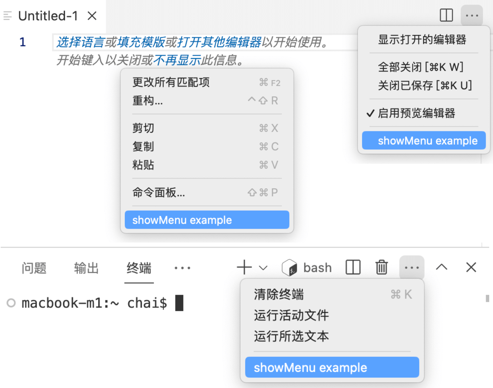

# 3.6 定制菜单

VS Code的基本功能通过命令来抽血，命令可以绑定到快捷键和菜单。相比快捷键菜单是比较容易记住的入口，特别是针对不同的上下文环境可以设置不同的菜单。本届展示菜单的基本用法。

## 3.6.1 将命令绑定为菜单

要使用菜单先得定义命令，然后才能将命令的ID绑定到菜单。比如有 `extdev.showMenu` 命令：

```js
function activate(context) {
	context.subscriptions.push(
		vscode.commands.registerCommand('extdev.showMenu', () => {
			vscode.window.showInformationMessage('extdev.showMenu')
		})
	);
}
```

然后在 `package.json` 文件de `"contributes.menus"` 定义菜单的信息：

```json
{
	"contributes": {
		"commands": [
			{ "command": "extdev.showMenu", "title": "showMenu example" }
		],
		"menus": {
			"editor/title": [
				{"command": "extdev.showMenu"}
			],
			"editor/context":[
				{"command": "extdev.showMenu"}
			],
			"view/title": [
				{"command": "extdev.showMenu"}
			]
		}
	},
}
```

这里在几个地方定义了菜单：编辑窗口的标题部分、编辑窗口的上下文菜单、视图的标题。效果如下：




## 3.6.2 菜单入口位置和条件

VS Code针对很多场景可定义菜单，以下是部分参考列表：

- `commandPalette`：全局命令面板
- `editor/title`：编辑器标题菜单栏
- `editor/context`：编辑器上下文菜单
- `explorer/context`：资源管理器视图上下文菜单
- `view/title`：查看标题菜单
- `view/item/context`：查看项目上下文菜单
- `webview/context`：任何网页视图上下文菜单
- 其他省略场景以及对应的子菜单

其中比较常见的是 `explorer/context` 和 `editor/context` 相关的菜单。以上定义的是菜单入口位置的Key，比如在命令面板添加命令配置如下：

```json
{
	"contributes": {
		"menus": {
			"commandPalette": [
				{"command": "extdev.showMenu"}
			],
		}
	}
}
```

在`"commandPalette"`入口位置可以定义一组命令。每个命令项中除了`command`属性指定具体命令外，还有其他可选属性：

- `submenu`：在子菜单添加，需要配合子菜单定义
- `when`：根据不同的条件控制菜单是否可见
- `alt`：按住`alt`时对应的备用命令
- `group`：定义菜单分组

比如下面的配置是为 Markdown 格式文件配置预览能力：

```json
{
	"contributes": {
		"menus": {
			"editor/title": [
				{
					"when": "resourceLangId == markdown",
					"command": "markdown.showPreview",
					"alt": "markdown.showPreviewToSide",
					"group": "navigation"
				}
			]
		}
	}
}
```

通过 `when` 属性还可以选择不同的 view 类型，比如 `view == terminal && isMac` 表示在 macOS 系统下的命令行识图添加菜单。

`when` 完整的内置变量可以参考 [when clause contexts](https://code.visualstudio.com/api/references/when-clause-contexts)。

## 3.6.3 设置菜单图标

菜单的图标可以在命令中定义，下面的配置为命令 `extdev.showMenu` 添加的名字、分类和图标信息。

```json
{
	"contributes": {
		"commands": [
			{
				"command": "extdev.showMenu",
				"title": "Show Menu",
				"category": "Extdev",
				"icon": {
					"light": "path/to/light/icon.svg",
					"dark": "path/to/dark/icon.svg"
				}
			}
		]
	}
}
```

其中图标部分可以针对亮色和暗色定义不同的图标。

## 3.6.4 小结

本节展示的菜单的基本用法，VS Code针对菜单出现的位置、条件等都作了精心的设计，这些都给菜单带来了极大的灵活性。

